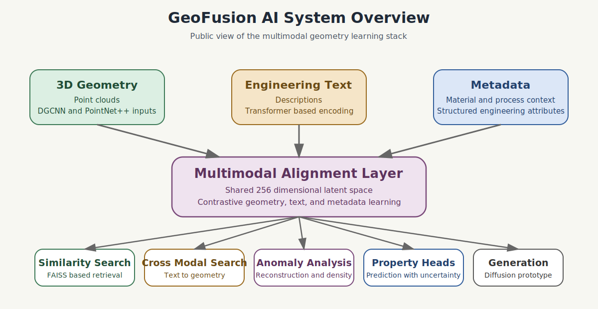
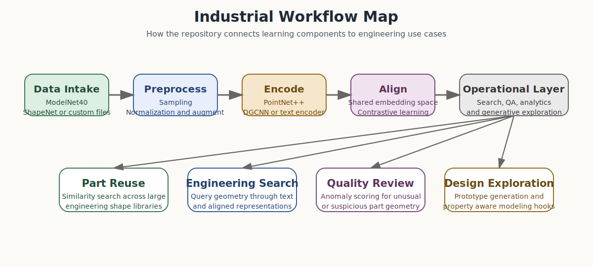
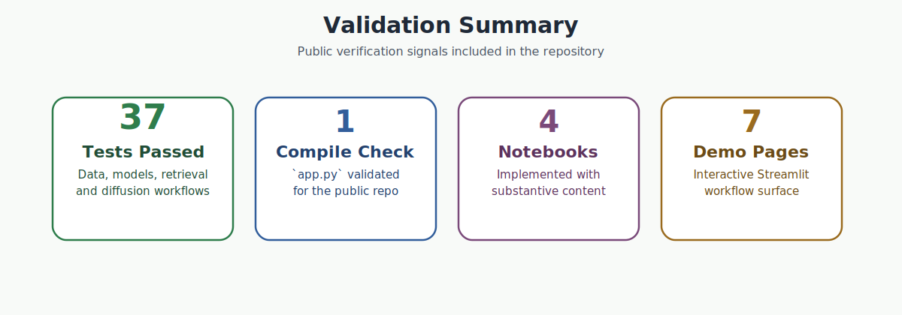
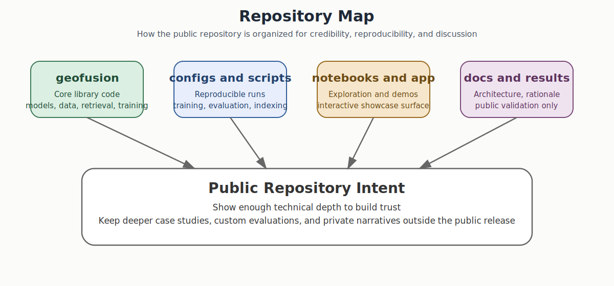

# GeoFusion AI

**Industrial Multimodal AI for 3D CAD Geometry Understanding**

GeoFusion AI is a deep learning platform that unifies 3D geometric representations, natural language descriptions, and engineering metadata into a shared embedding space. It supports part similarity retrieval, manufacturing anomaly detection, text-to-shape search, property prediction with uncertainty quantification, and diffusion-based shape generation. The system is designed for industrial CAD/CAE workflows where engineers need to search, classify, and reason about large collections of 3D parts.

## Public Showcase Scope

This repository is intentionally a curated public showcase.

It is designed to demonstrate:

1. clear problem understanding
2. engineering rigor
3. reproducibility discipline
4. design decisions
5. industrial relevance

It is not intended to expose the full private working context behind the broader project.

The public version therefore does not include:

1. full private case studies
2. internal benchmark packs
3. collaboration specific assets
4. complete presentation narratives used in direct discussions
5. the wider private workspace surrounding this repository

This keeps the repository useful as a professional hook for collaboration, networking, and work opportunities without giving away all of the deeper project value.

**Author:** Lebede Ngartera, PhD | Senior AI Engineer | TeraSystemsAI LLC  
**Contact:** ngarteralebede12@gmail.com  
**LinkedIn:** [linkedin.com/in/lebede-ngartera-82429343](https://linkedin.com/in/lebede-ngartera-82429343)  
**ORCID:** [0000-0003-0561-1305](https://orcid.org/0000-0003-0561-1305)

[Open the collaboration landing page](docs/index.html)

---

## Problem Statement

Engineering organizations manage catalogs of tens of thousands of 3D CAD parts. Finding similar parts for design reuse, detecting geometric anomalies that signal manufacturing risks, and connecting geometry to engineering text and simulation data are tasks that remain largely manual. GeoFusion AI addresses this by learning joint representations across geometry, language, and metadata, enabling automated retrieval, classification, and quality assurance at scale.



---

## Architecture

The system follows a multi-encoder fusion design with a shared latent space. Each input modality has a dedicated encoder. A contrastive alignment layer (CLIP-style, using NT-Xent loss with learnable temperature) projects all modalities into a common 256-dimensional embedding space. Downstream tasks consume these embeddings through specialized workflow modules.



```
Input Modalities
    3D Point Clouds          Text Descriptions         Manufacturing Metadata
    (N x 3 coordinates)      (Engineering language)     (Material, tolerance, process)
         |                         |                          |
         v                         v                          v
    Geometry Encoder          Text Encoder              Metadata Encoder
    (PointNet++ / DGCNN)      (Transformer)             (Embedding + FC)
         |                         |                          |
         +------------+------------+-----------+--------------+
                      |
                      v
         Multimodal Contrastive Aligner
         (NT-Xent, temperature-scaled)
                      |
                      v
              Shared Embedding Space (256-dim)
                      |
     +--------+-------+-------+---------+----------+
     |        |               |         |          |
     v        v               v         v          v
  Similarity  Text-to-Shape  Anomaly  Property   Shape
  Search      Retrieval      Detect.  Prediction Generation
  (FAISS)     (Cross-modal)  (AE+KDE) (w/ UQ)   (DDPM)
```

---

## Core Capabilities

### Part Similarity Retrieval
Given a query 3D shape, encode it into the shared embedding space and retrieve the most similar parts from a FAISS index. Supports exact search (Flat), approximate search (IVFFlat), and quantized search (IVFPQ). Returns ranked results with cosine similarity scores. Includes near-duplicate detection and KMeans-based part clustering.

### Text-to-Geometry Search
Accepts natural language queries such as "lightweight bracket with curved support arm" and retrieves 3D shapes whose embeddings best match the projected text embedding. This is powered by the contrastive alignment between the geometry and text encoder outputs.

### Anomaly Detection
Detects geometric anomalies that may indicate manufacturing defects or quality risks. Uses an ensemble of reconstruction-based scoring (point cloud autoencoder with Chamfer distance) and density-based scoring (distance to nearest normal embedding cluster). Calibrated on normal data to establish warning and critical thresholds at configurable percentiles.

### Property Prediction with Uncertainty
Predicts physical and manufacturing properties (mass, volume, surface area, max stress, manufacturability score) from geometry embeddings. Each prediction includes an aleatoric uncertainty estimate via learned log-variance, providing confidence scores for downstream engineering decisions.

### Diffusion-Based Shape Generation
A DDPM-style generative model that learns to denoise point clouds over 1000 timesteps with a linear noise schedule. Supports unconditional generation and conditional generation with geometry or text embeddings as conditioning signals. Produces novel 3D shapes as (N x 3) point clouds.

### Cross-Modal Retrieval
Bidirectional retrieval across all modalities: shape-to-shape, text-to-shape, shape-to-text, and text-to-text. Each direction uses the aligned embedding space to compute cosine similarity across stored indices.

---

## Verified Results

This repository makes only claims that are directly supported by the current codebase and validation runs.

1. Repository validation
    37 automated tests passed across data, models, and retrieval modules.

2. Runtime maturity
    `app.py` compiled successfully during validation.

3. Demonstration coverage
    Four notebooks are implemented with substantive runnable content.
    The Streamlit application exposes seven interactive workflow pages.

4. Functional system scope
    The codebase implements classification, retrieval, anomaly detection, cross modal search, and diffusion based generation.

5. Reproducibility support
    The repository includes configuration files, tests, a Dockerfile, CI workflow, and a self contained local demo.

Additional validation notes are recorded in [results/README.md](/e:/GIThub_Prohect/results/README.md).



---

## Models

### PointNet++ Encoder
Hierarchical point set learning with three Set Abstraction layers. SA1 samples 512 points (radius 0.2, 32 neighbors); SA2 samples 128 points (radius 0.4, 64 neighbors); SA3 applies global aggregation. Each layer uses a shared MLP with batch normalization and ReLU. Final projection maps the 1024-dim global feature to a 256-dim embedding. Supports optional surface normals as input channels.

### DGCNN Encoder
Dynamic Graph CNN with four EdgeConv blocks. At each layer, a k-nearest-neighbor graph (k=20) is constructed in feature space, and edge features h(x_i, x_j minus x_i) are processed through shared MLPs. Features from all layers are concatenated, passed through a 1D convolution bottleneck, and pooled (global max + mean) to produce the final embedding.

### GNN Encoder (PyTorch Geometric)
Flexible graph neural network supporting EdgeConv, GATConv (multi-head attention), and GraphSAGE convolution types. Designed for face-adjacency graphs extracted from B-Rep CAD topology, where nodes represent faces and edges represent shared edges/vertices.

### Text Encoder
Transformer-based encoder using pretrained sentence-transformers (default: all-MiniLM-L6-v2). Applies mean pooling over token embeddings and projects through a two-layer MLP to the shared 256-dim space. Includes a lightweight fallback (SimpleTextEncoder) using learned embeddings and 1D convolutions for environments without HuggingFace dependencies.

### Multimodal Aligner (GeoFusionModel)
The central model integrating all encoders. Computes geometry and text embeddings, projects them through learnable projection heads, and produces a temperature-scaled similarity matrix. Training uses symmetric NT-Xent loss. Optional classification head and metadata encoder for supervised and multi-signal training.

### Point Cloud Autoencoder
Encoder-decoder architecture for anomaly detection. The encoder maps point clouds through Conv1d layers (3 to 64 to 128 to 256 to 512) with max pooling to a latent code. The decoder reconstructs the point cloud from the latent code. Reconstruction quality is measured by Chamfer distance.

---

## Data Pipeline

### Supported Datasets
**ModelNet40:** 40-class 3D object classification benchmark. Loaded from .txt files with 2048 points per sample (xyz + normals, 6 channels).

**ShapeNet:** Multi-category dataset with part segmentation annotations. Loaded from .pts files with optional text metadata.

**Custom Data:** Generic PointCloudDataset supporting .npy, .npz, .txt, and .ply formats.

### Augmentation Transforms
The data module provides a composable augmentation pipeline:
Farthest Point Sampling (subsample to fixed point count),
Normalize (center to origin, scale to unit sphere),
Random Rotation (configurable axis and max angle),
Random Jitter (Gaussian noise with clipping),
Random Scale (uniform 0.8x to 1.25x),
Random Flip (reflection along any axis).

### Synthetic Text Generation
TextMetadataGenerator produces engineering-style descriptions for shapes to enable multimodal training without manual annotation. Uses category-specific templates with randomized adjectives, geometric properties, and manufacturing context. Example output: "A compact elongated fuselage assembly with swept wing configuration featuring complex curvature profiles. Suitable for CNC machined in aluminum alloy."

---

## Training

Training is fully config-driven through YAML files. The Trainer class supports:

AdamW optimizer with configurable learning rate (default 1e-3) and weight decay (1e-4).
Cosine annealing and ReduceLROnPlateau schedulers.
Linear warmup (default 10 epochs).
Gradient clipping (default 1.0).
Early stopping with configurable patience (default 20 epochs).
Periodic checkpointing (model + optimizer state).
Optional Weights and Biases integration.

### Loss Functions
**NT-Xent Loss:** Symmetric normalized temperature-scaled cross-entropy for contrastive multimodal alignment.
**Triplet Loss:** Margin-based metric learning for embedding separation.
**Classification Loss:** Cross-entropy with label smoothing (default 0.1).
**Multi-Task Loss:** Weighted combination with learnable or fixed per-task weights.

### Evaluation Metrics
Classification: Top-1 and Top-5 accuracy.
Retrieval: Recall@K, Precision@K, Mean Average Precision (mAP).
Cross-Modal: Bidirectional retrieval metrics (geometry-to-text, text-to-geometry).
Anomaly: Threshold-calibrated detection rates at configurable percentiles.

---

## Retrieval System

### FAISS Index
Supports three index types for different scale and accuracy tradeoffs:
Flat (exact brute-force search),
IVFFlat (approximate with 100 Voronoi cells, 10 probed at query time),
IVFPQ (product-quantized for memory efficiency).
Metric options: cosine similarity (via L2 on normalized vectors) or L2 Euclidean distance.

### Embedding Store
Manages computed embeddings with associated metadata and labels. Supports incremental addition, batch computation from model and dataloader, and persistence to disk (NumPy arrays + JSON metadata).

---

## Project Structure

```
GIThub_Prohect/
    .github/
    configs/
    data/
    docs/
    docker/
    examples/
    experiments/
geofusion/
    __init__.py
    data/
        __init__.py
        datasets.py          ModelNet40, ShapeNet, generic point cloud loaders
        transforms.py        Composable augmentation pipeline
        text_metadata.py     Synthetic engineering text generator
        download.py          Dataset download utilities
    models/
        __init__.py
        pointnet2.py         PointNet++ encoder and classifier
        gnn_encoder.py       DGCNN and GNN encoders
        text_encoder.py      Transformer and lightweight text encoders
        multimodal.py        GeoFusionModel with contrastive alignment
        anomaly.py           Autoencoder and anomaly detector
        diffusion.py         DDPM shape generation
    training/
        __init__.py
        trainer.py           Config-driven training orchestrator
        losses.py            NT-Xent, triplet, classification, multi-task
        metrics.py           Accuracy, retrieval recall/precision/mAP
    retrieval/
        __init__.py
        search.py            FAISS index wrapper
        embeddings.py        Embedding storage and management
        cross_modal.py       Bidirectional cross-modal retrieval
    workflows/
        __init__.py
        part_similarity.py   Similar part retrieval and clustering
        anomaly_detection.py Manufacturing anomaly detection
        property_prediction.py  Property prediction with uncertainty
        text_search.py       Natural language to geometry search
scripts/
    train_geometry.py        Train PointNet++ or DGCNN on ModelNet40
    train_multimodal.py      Train geometry-text alignment on ShapeNet
    build_index.py           Compute embeddings and build FAISS index
    evaluate.py              Classification and retrieval evaluation
    demo.py                  Interactive CLI demo
    local_demo.py            Self-contained demo with synthetic data
    download_data.py         Download ModelNet40 and ShapeNet
configs/
    default.yaml             Global configuration defaults
    pointnet2.yaml           PointNet++ training configuration
    gnn.yaml                 GNN/DGCNN training configuration
    multimodal.yaml          Multimodal alignment configuration
notebooks/
    01_data_exploration.ipynb
    02_geometry_encoding.ipynb
    03_multimodal_alignment.ipynb
    04_retrieval_demo.ipynb
results/
    README.md
tests/
    conftest.py
    test_data.py             Transform and metadata generation tests
    test_models.py           Encoder, aligner, anomaly, diffusion tests
    test_retrieval.py        FAISS index, embedding store, search tests
docker/
    Dockerfile               Containerized deployment
app.py                       Streamlit interactive dashboard
```

### Structure Rationale

1. `geofusion/` contains reusable source code rather than notebook only logic.
2. `notebooks/` is limited to exploration and demonstration.
3. `configs/` makes experiments reproducible.
4. `docs/` captures architecture and design decisions.
5. `results/` records what is validated and what is not claimed.
6. `experiments/` is reserved for benchmark manifests and run summaries.



---

## Interactive Dashboard

The Streamlit application (app.py) provides a browser-based interface for exploring the full pipeline without writing code. It includes seven pages:

**Overview:** Project introduction with an interactive gallery of five synthetic 3D shapes (sphere, cube, cylinder, cone, torus) rendered as Plotly 3D scatter plots.

**Data Transforms:** Apply and visualize each augmentation step (farthest point sampling, normalization, rotation, jitter, scaling) on a selected shape.

**PointNet++ Classification:** Train the PointNet++ encoder on synthetic shape classes directly in the browser. Displays real-time training curves (loss, accuracy, per-class accuracy).

**DGCNN Encoder:** Compute DGCNN embeddings for all shapes and visualize the inter-shape similarity matrix as a heatmap.

**Similarity Search:** Build a FAISS index on computed embeddings and run top-k similarity queries with ranked results.

**Anomaly Detection:** Calibrate an anomaly detector on normal shapes and score new shapes. Displays risk levels (normal, warning, critical) with threshold visualization.

**Shape Generation:** Generate novel 3D point clouds using the diffusion model, rendered as interactive 3D plots.

---

## Quick Start

### Installation

```bash
git clone https://github.com/lebede-ngartera/GIThub_Prohect.git
cd GIThub_Prohect
pip install -e ".[dev]"
```

### Run the Self-Contained Demo (No Data Download Required)

```bash
python scripts/local_demo.py
```

This generates synthetic shapes (sphere, cube, cylinder, cone), trains a PointNet++ encoder, runs DGCNN similarity analysis, builds a FAISS index, performs anomaly detection, and generates new shapes via diffusion, all without external data.

### Full Training Pipeline

```bash
python scripts/download_data.py --dataset modelnet40
python scripts/train_geometry.py --config configs/pointnet2.yaml
python scripts/train_multimodal.py --config configs/multimodal.yaml
python scripts/build_index.py --checkpoint outputs/best_model.pt
python scripts/evaluate.py --checkpoint outputs/best_model.pt
python scripts/demo.py --index outputs/faiss_index
```

The runnable assets in this public repository are representative demos. They are meant to open technical conversations, not to publish every deeper case-study asset in full.

### Launch the Interactive Dashboard

```bash
streamlit run app.py --server.port 8501
```

### Docker

```bash
docker build -t geofusion -f docker/Dockerfile .
docker run -p 8000:8000 geofusion
```

---

## Configuration

All training hyperparameters are managed through YAML configuration files in configs/. Key settings:

| Parameter | Default | Description |
|-----------|---------|-------------|
| num_points | 2048 | Points per sample |
| batch_size | 32 | Training batch size |
| embed_dim | 256 | Shared embedding dimension |
| learning_rate | 1e-3 | AdamW learning rate |
| epochs | 200 | Maximum training epochs |
| scheduler | cosine | Learning rate schedule |
| warmup_epochs | 10 | Linear warmup period |
| early_stopping_patience | 20 | Epochs without improvement |
| temperature | 0.07 | NT-Xent contrastive temperature |
| index_type | IVFFlat | FAISS index type |
| anomaly_threshold | 95th percentile | Anomaly detection threshold |

---

## Testing

```bash
pytest tests/ -v --tb=short
```

The test suite covers data transforms and metadata generation, all encoder architectures (PointNet++, DGCNN, text encoder, multimodal aligner), anomaly detection and diffusion model forward passes, FAISS index operations, embedding storage, and similarity search. Tests use synthetic data and verify output shapes, numerical properties, gradient flow, and serialization round-trips.

---

## Design Choices

1. Point clouds are the primary executable geometry representation because they are practical across public datasets and synthetic demos.
2. PointNet++ and DGCNN are both included because they capture different geometric biases and support more honest model comparison.
3. A shared embedding space is used because retrieval, text search, and metadata fusion become simpler when all modalities are aligned.
4. FAISS was chosen because scalable similarity search is necessary for real part library workflows.
5. The anomaly workflow combines reconstruction and density scoring because one signal alone is usually not robust enough.

The detailed rationale is in [docs/design_decisions.md](/e:/GIThub_Prohect/docs/design_decisions.md).

---

## Industrial Relevance

This project is relevant to industrial CAD and CAE workflows in several ways.

1. Part reuse in large design libraries
2. Early geometry screening for quality and manufacturing review
3. Cross modal engineering search when text metadata is incomplete
4. A technical foundation for coupling geometry, simulation, and structured engineering attributes

---

## Technology Stack

| Category | Tools |
|----------|-------|
| Deep Learning | PyTorch, PyTorch Geometric (optional) |
| 3D Processing | Open3D, Trimesh |
| NLP | HuggingFace Transformers, Sentence-Transformers |
| Vector Search | FAISS (flat, IVF, PQ indices) |
| Experiment Tracking | Weights and Biases (optional) |
| Configuration | OmegaConf, PyYAML |
| Visualization | Plotly, Matplotlib |
| Infrastructure | Docker, pytest, Black, Ruff |
| Python | 3.10+ |

---

## Research Context

This project explores how foundation model concepts can be applied to industrial 3D geometry workflows. It draws on the following research directions:

**Geometric Deep Learning.** PointNet++ (Qi et al., NeurIPS 2017) and DGCNN (Wang et al., SIGGRAPH 2019) for hierarchical and dynamic graph-based point cloud processing. Graph neural networks (GAT, GraphSAGE) for face-adjacency graphs extracted from B-Rep CAD topology.

**Contrastive Multimodal Learning.** CLIP-style alignment (Radford et al., ICML 2021) adapted for geometry-text pairs, using normalized temperature-scaled cross-entropy loss with learnable temperature.

**Diffusion Models for 3D.** DDPM-style (Ho et al., NeurIPS 2020) iterative denoising applied to point cloud generation, with conditioning on geometry and text embeddings.

**Industrial Applications.** Similarity-based design reuse, manufacturing anomaly detection using reconstruction and density scoring, and uncertainty-quantified property prediction for engineering decision support.

---

## Limitations

1. The active runnable pipeline is point cloud centric rather than a full production STEP to B Rep ingestion workflow.
2. Public benchmark datasets are not substitutes for proprietary automotive CAD corpora.
3. The repository does not currently publish production scale retrieval metrics on an industrial dataset.
4. Enterprise PLM, CAD kernel, and CAE integration are not yet implemented.
5. The diffusion component is a research prototype, not a production generative design system.

---

## Future Work

1. Add direct STEP to graph extraction with a CAD kernel based pipeline.
2. Add domain specific retrieval benchmarks and latency reports.
3. Add richer simulation aware property prediction.
4. Add experiment run summaries under `experiments/` and benchmark outputs under `results/`.
5. Add a service layer for deployment into enterprise engineering workflows.

---

## Collaboration

This repository is structured to attract serious technical discussion while preserving deeper project materials for direct interaction.

Possible collaboration topics include:

1. 3D geometric deep learning for industrial systems
2. CAD retrieval and design reuse workflows
3. anomaly detection for engineering quality pipelines
4. multimodal geometry plus text representation learning
5. AI infrastructure for simulation aware product development

The public code is the entry point. The full case-study narrative does not need to be published for the repository to demonstrate capability.

---

## Documentation

1. [docs/architecture.md](/e:/GIThub_Prohect/docs/architecture.md)
2. [docs/design_decisions.md](/e:/GIThub_Prohect/docs/design_decisions.md)
3. [docs/api_reference.md](/e:/GIThub_Prohect/docs/api_reference.md)
4. [docs/technical_report.md](/e:/GIThub_Prohect/docs/technical_report.md)
5. [docs/github_deployment.md](/e:/GIThub_Prohect/docs/github_deployment.md)
6. [results/README.md](/e:/GIThub_Prohect/results/README.md)

---

## Selected Publications by the Author

Bayesian RAG: Uncertainty-Aware Retrieval for Reliable Financial Question Answering. Frontiers in Artificial Intelligence, 2025.

Hybrid Naive Bayes Models for Scam Detection: Comparative Insights From Email and Financial Fraud. IEEE Access, 2025.

Application of Bayesian Neural Networks in Healthcare: Three Case Studies. Machine Learning and Knowledge Extraction, 2024.

Enhancing Autonomous Systems with Bayesian Neural Networks: A Probabilistic Framework for Navigation and Decision-Making. Frontiers in Built Environment, 2025.

---

## License

MIT License. See LICENSE for details.
